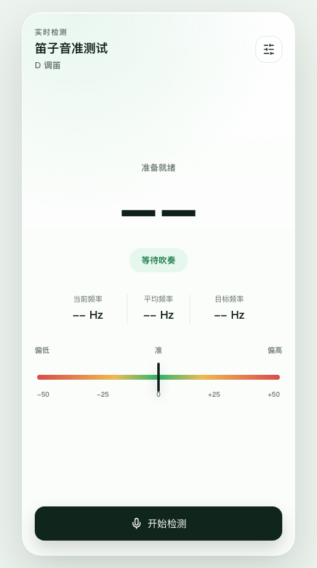

# Dizi Tuner H5

[](https://github.com/ywandy/dizhi-tunner/actions/workflows/deploy.yml)

[中文](README.md)

A mobile-first, browser-only dizi tuning tool. It uses the microphone to detect pitch in real time, then shows current frequency, 1-second rolling average frequency, target frequency, and cents deviation for quick intonation practice.



## Live Demo

- Cloudflare Pages: [https://ditune.ywandy.top/](https://ditune.ywandy.top/)
- Legacy GitHub Pages URL: [https://ywandy.github.io/dizhi-tunner/](https://ywandy.github.io/dizhi-tunner/)

Allow microphone access before tuning. Chrome, Edge, or Safari is recommended.

## Features

- Supports `C / D / E / F / G` dizi keys, defaulting to `D`
- Supports `tube-as-5 / tube-as-2 / tube-as-1` tube-note transposition fingerings
- Uses the 5th-octave key tonic as the pitch basis; for example, `E · tube-as-5` maps `low 5` to `B4 / 493.88Hz`
- Includes real-time detection and target-note practice modes
- Shows real-time cents deviation on the meter: center is `0`, left is flat, right is sharp
- Uses a 1-second rolling average frequency for stable tuning feedback
- Smoothly returns the meter pointer to center when no stable pitch is detected
- Remembers the last selected key, fingering, mode, and target note
- Fully client-side: no backend, no login, no uploaded recordings

## Tech Stack

- React + Vite + TypeScript
- Tailwind CSS + shadcn-style UI components
- `pitchy` for pitch detection
- Vitest + Testing Library
- GitHub Actions + Cloudflare Pages

## Local Development

```bash
pnpm install
pnpm dev
```

Useful scripts:

```bash
pnpm test
pnpm typecheck
pnpm build
pnpm preview
```

## Tuning Math

The cents deviation uses the standard logarithmic pitch-distance formula:

```ts
cents = 1200 * Math.log2(currentFreq / targetFreq)
```

Feedback thresholds:

- `<= 5 cents`: Accurate
- `<= 10 cents`: Mostly in tune
- `<= 20 cents`: Slightly sharp or flat
- `> 20 cents`: Clearly sharp or flat

## Deployment

After every push to `main`, GitHub Actions automatically:

1. Installs dependencies
2. Runs tests
3. Runs type checks
4. Builds the static app
5. Deploys to Cloudflare Pages
