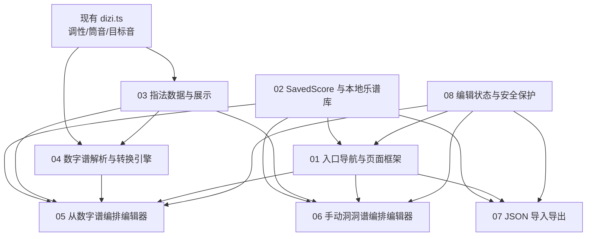

# 洞洞谱功能拆解总览

## 1. 背景

原始 PRD：`prd/dongdongpu/raw/竹笛洞洞谱功能_PRD.md`

当前产品已经具备竹笛音准检测能力，核心事实源包括：

- `src/core/dizi.ts`：支持 C / D / E / F / G 调笛，支持 `tube_as_5` / `tube_as_2` / `tube_as_1` 三套筒音指法，能生成目标音的 `label / midi / frequency`。
- `src/core/preferences.ts`：已有 localStorage 偏好保存、解析和失败兜底模式。
- `src/App.tsx`：当前只有调音器和设置两个 Hash 页面，底部导航为“测音 / 设置”。
- `prd/dizi_tuner_prd.md` 与 `prd/dizi_fingering_range_logic.md`：说明当前调性、筒音指法、音高生成规则。

洞洞谱功能应在现有纯前端、移动优先、无账号、无后端的产品形态上扩展。

## 2. 拆解原则

1. 先做公共底座，再做编辑器。
2. 数字谱模式与手动模式共用 `SavedScore`、本地乐谱库、JSON 导入导出、洞洞谱渲染。
3. 复用当前调性和筒音指法事实源，不在洞洞谱里另起一套调性模型。
4. 第一版不引入云同步、账号、PDF、打印、MIDI、图片识别、乐声识别和复杂节奏编辑。
5. 验收以功能闭环和手工走查为主，不在本轮 PRD 中要求新增单元测试。

## 3. 当前 PRD 与现有功能差异

| 项目 | 原始 PRD | 当前产品事实 | 拆解建议 |
|---|---|---|---|
| 笛子调 | C / D / E / F / G / A / Bb | C / D / E / F / G | P0 对齐当前五个调，A / Bb 放后续扩展 |
| 筒音指法字段 | `tube-as-5` | `tube_as_5` / `tube_as_2` / `tube_as_1` | 内部字段统一用下划线命名 |
| 音高能力 | 需要数字谱转真实音高 | 已有目标音生成，但没有数字谱解析 | 新增数字谱解析与转调转换引擎 |
| 洞洞图 | 需要 `●●●○○○` | 当前只有目标音频率，没有物理孔位 | 新增指法数据与洞洞谱渲染底座 |
| 本地保存 | `dizi-hole-score-library-v1` | 已有偏好保存 `dizi-tuner-preferences-v1` | 复用安全读写风格，新增乐谱库 key |
| 页面导航 | 独立“洞洞谱”入口 | 当前底部导航只有测音/设置 | 新增洞洞谱主入口与页面框架 |

## 4. 功能项拆解

| 编号 | 功能 PRD | 核心产物 | 优先级 |
|---|---|---|---|
| 01 | 入口导航与页面框架 | 洞洞谱入口、首页、新建方式选择、编辑器路由 | P0 |
| 02 | SavedScore 数据模型与本地乐谱库 | 统一数据结构、localStorage、保存/打开/删除 | P0 |
| 03 | 洞洞谱指法数据与展示 | 孔位数据、洞洞图展示、指法备注 | P0 |
| 04 | 数字谱解析与转换引擎 | token 解析、音高换算、指法匹配、错误提示 | P0 |
| 05 | 从数字谱编排编辑器 | 数字谱输入、简谱键盘、实时结果、保存 | P0 |
| 06 | 手动洞洞谱编排编辑器 | 指法键盘、内容区、选中编辑、保存 | P2 |
| 07 | JSON 导入导出 | 完整 SavedScore 导出、文件导入、校验与冲突处理 | P1 |
| 08 | 编辑状态与安全保护 | dirty 状态、未保存提醒、删除确认、异常兜底 | P1 |

## 5. 依赖关系图

## 6. 建议实施顺序

1. `02 SavedScore 数据模型与本地乐谱库`
2. `03 洞洞谱指法数据与展示`
3. `04 数字谱解析与转换引擎`
4. `01 入口导航与页面框架`
5. `05 从数字谱编排编辑器`
6. `07 JSON 导入导出`
7. `08 编辑状态与安全保护`
8. `06 手动洞洞谱编排编辑器`

说明：原始 PRD 把手动编排列入核心目标，但开发优先级中放在 P2。为了第一版快速形成可用闭环，建议先完成“数字谱生成 + 保存打开 + 导入导出”，再补手动编排。

