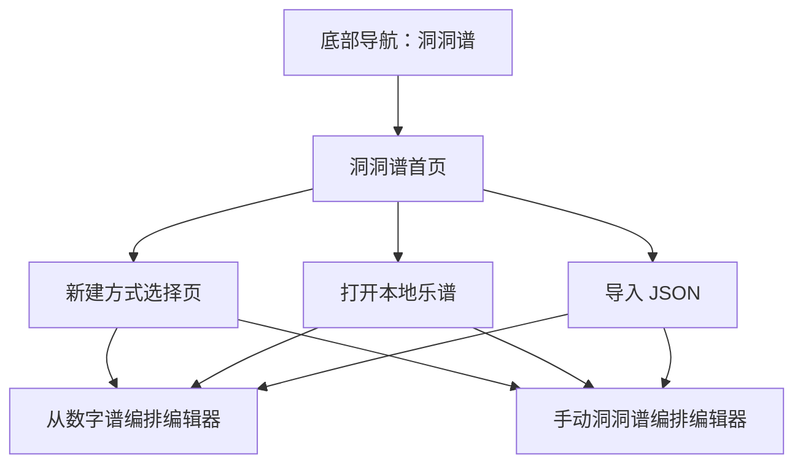

# 功能 PRD：入口导航与页面框架

## 1. 功能目标

在当前笛子音准测试 WebApp 中增加独立的“洞洞谱”功能入口，让用户可以进入洞洞谱首页、选择新建方式、打开对应编辑器，并从编辑器返回乐谱库。

该功能只定义页面框架和导航关系，不包含具体转换算法、存储实现和导入导出细节。

## 2. 当前功能基础

当前 `src/App.tsx` 使用 Hash 判断页面：

- `#/tuner` 或默认：测音页
- `#/settings`：设置页

当前 Web 底部导航包含：

- 测音
- 设置

洞洞谱需要在这个结构上新增入口，且不影响现有测音流程。

## 3. 页面地图



## 4. 页面范围

### 4.1 洞洞谱首页

首页展示：

- 标题：洞洞谱
- 操作按钮：新建、导入 JSON
- 本地乐谱列表
- 空状态

首页不直接编辑内容，只负责入口、列表和乐谱操作。

### 4.2 新建方式选择页

展示两个入口：

- 从数字谱编排
- 编排洞洞谱

点击后进入对应编辑器，并使用默认配置初始化编辑状态。

### 4.3 编辑器页面

编辑器分为两类：

- `jianpu-generated`：从数字谱编排编辑器
- `manual-hole-score`：手动洞洞谱编排编辑器

打开本地乐谱或导入 JSON 后，应根据 `SavedScore.mode` 进入对应编辑器。

## 5. 路由建议

延续当前 Hash 模式，建议新增：

| 路由 | 页面 |
|---|---|
| `#/hole-scores` | 洞洞谱首页 |
| `#/hole-scores/new` | 新建方式选择页 |
| `#/hole-scores/jianpu` | 从数字谱编排编辑器 |
| `#/hole-scores/manual` | 手动洞洞谱编排编辑器 |

如果打开已有乐谱，可以在内存里维护 `currentScoreId`，也可以使用：

| 路由 | 页面 |
|---|---|
| `#/hole-scores/jianpu/:id` | 打开数字谱模式乐谱 |
| `#/hole-scores/manual/:id` | 打开手动模式乐谱 |

第一版为了减少路由复杂度，可以使用 Hash 页面 + 应用状态承载当前乐谱。

## 6. 底部导航

Web 底部导航新增“洞洞谱”：

```text
测音 | 洞洞谱 | 设置
```

移动 H5 被 Expo WebView 包裹时，洞洞谱仍属于 H5 内部功能；除非后续要在原生层增加独立 Tab，否则第一版不要求改 Expo 原生导航。

## 7. 空状态

当本地没有乐谱：

```text
还没有保存的洞洞谱
可以从数字谱生成，也可以手动编排一份洞洞谱
[新建洞洞谱]
```

点击按钮进入新建方式选择页。

## 8. 非目标

- 不做账号入口。
- 不做云端乐谱列表。
- 不做社区、推荐、搜索。
- 不改变现有测音和设置的核心交互。

## 9. 验收标准

1. 底部导航可以进入“洞洞谱”。
2. 洞洞谱首页能展示空状态和本地乐谱列表区域。
3. 点击“新建”能进入新建方式选择页。
4. 选择“从数字谱编排”能进入数字谱编辑器。
5. 选择“编排洞洞谱”能进入手动洞洞谱编辑器。
6. 打开本地乐谱时能根据 `mode` 进入正确编辑器。
7. 返回时能回到洞洞谱首页。
8. 现有测音页和设置页仍能正常进入。

