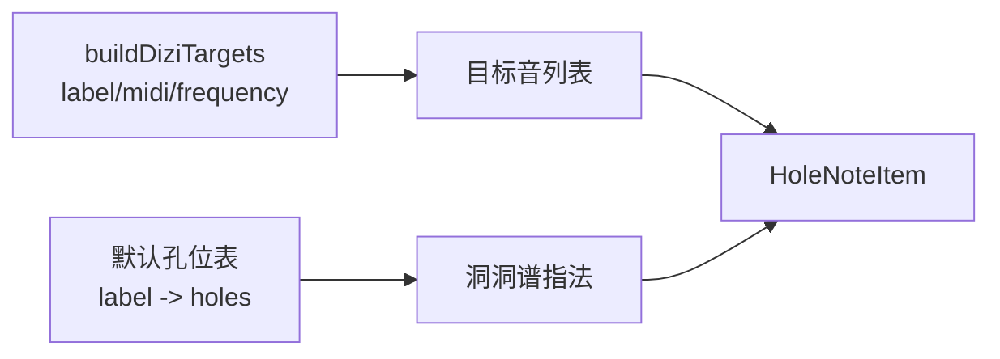

# 功能 PRD：洞洞谱指法数据与展示

## 1. 功能目标

为洞洞谱功能补齐“物理孔位”数据和展示组件，使系统不仅能知道某个目标音的 `midi / frequency`，还能展示对应的洞洞图，例如：

```text
●●●○○○
```

该能力同时服务于：

- 数字谱转换结果展示
- 手动编排指法键盘
- 本地乐谱预览
- JSON 导入导出内容展示

## 2. 当前功能基础

当前 `src/core/dizi.ts` 已能生成目标音：

```ts
type DiziTarget = {
  label: JianpuLabel
  midi: number
  frequency: number
}
```

但它不包含：

- 六孔开闭状态
- 半孔
- 替代指法
- 指法备注

洞洞谱需要新增独立的指法数据层，不应把物理孔位硬塞进音准检测算法里。

## 3. 数据范围

第一版至少覆盖当前三套筒音指法的常用目标范围：

| 指法 | 当前目标范围 |
|---|---|
| `tube_as_5` | 低音5 到 高音6 |
| `tube_as_2` | 低音2 到 高音3 |
| `tube_as_1` | 1 到 倍高音2 |

每个目标音需要能匹配到一个默认孔位。遇到半孔、叉口或暂无稳定默认指法时，可以生成 warning，而不是强行假定。

## 4. 指法数据结构

```ts
type HoleState = 'closed' | 'open' | 'half'

type HoleFingering = {
  targetLabel: JianpuLabel
  holes: HoleState[]
  label: string
  remark?: string
  tags?: Array<'normal' | 'half-hole' | 'forked' | 'alternative' | 'needs-review'>
}
```

约束：

- `holes.length = 6`
- `label` 由 `holes` 渲染生成，避免人工写错。
- 同一个 `targetLabel` 第一版只需要一个默认指法。
- 后续需要替代指法时，再扩展为一对多。

## 5. 展示规则

| 状态 | 展示 |
|---|---|
| `closed` | `●` |
| `open` | `○` |
| `half` | `◐` |

示例：

```text
中音1
●●●○○○
备注：中音1
```

如果某个音暂无默认指法：

```text
该音暂无默认指法，可能需要半孔或替代指法
```

## 6. 与现有音高模型的关系



音高计算继续由 `src/core/dizi.ts` 负责。指法数据只负责展示和编排，不参与 cents、频率和实时识音逻辑。

## 7. 组件范围

建议组件：

| 组件 | 说明 |
|---|---|
| `HoleDiagram` | 展示 6 个孔位 |
| `HoleScorePreview` | 展示一组洞洞谱 item |
| `HoleFingeringCard` | 指法键盘上的单个音卡片 |

## 8. 非目标

- 不做完整竹笛流派指法百科。
- 不做多替代指法选择。
- 不做用户自定义指法库。
- 不把指法图接入实时音准检测结果。

## 9. 验收标准

1. 每个当前支持的目标音都能返回默认孔位或明确 warning。
2. 洞洞图能正确展示闭孔、开孔、半孔。
3. 数字谱转换结果能展示洞洞图。
4. 手动指法键盘能展示音名和洞洞图。
5. 存入 `SavedScore` 的 `HoleNoteItem.fingering.holes` 可以重新渲染出同样洞洞图。
6. 暂无指法的音不会导致页面崩溃。

