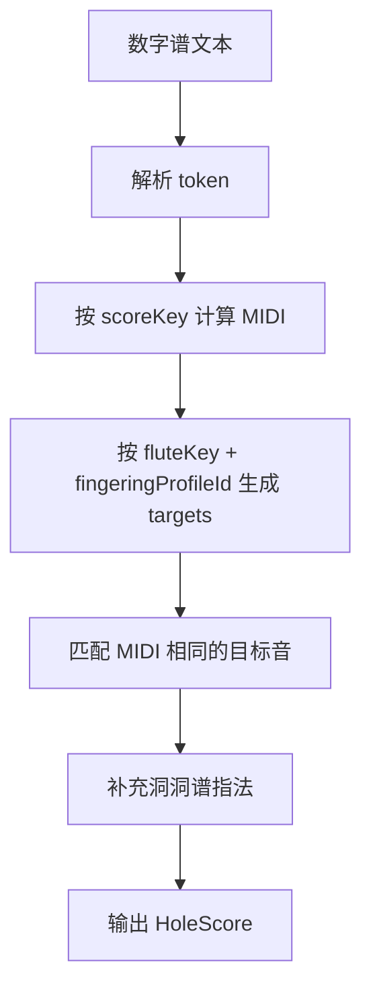

# 功能 PRD：数字谱解析与转换引擎

## 1. 功能目标

把用户输入的数字谱文本解析为 token，并根据曲谱调、笛子调、筒音指法转换为洞洞谱结果。

该功能是纯逻辑底座，供“从数字谱编排编辑器”实时调用。

## 2. 当前功能基础

当前项目已经具备：

- `buildDiziTargets({ diziKey, fingeringProfileId })`：生成当前笛子和指法下的目标音。
- `noteToMidi` / `midiToFreq`：基础 MIDI 和频率换算。
- 三套筒音指法的目标范围模板。

尚缺：

- 数字谱 token 解析。
- 曲谱调 `scoreKey` 到真实音高的换算。
- 真实音高到当前笛子目标音和洞洞图的匹配。
- 转换错误和 warning 聚合。

## 3. 支持输入

第一版支持：

```text
1 2 3 4 5 6 7
.1 .2 .3 .4 .5 .6 .7
1' 2' 3' 4' 5' 6' 7'
#4 b7
0
-
|
换行
```

## 4. Token 类型

```ts
type JianpuToken =
  | { type: 'note'; raw: string; degree: 1 | 2 | 3 | 4 | 5 | 6 | 7; accidental?: 'sharp' | 'flat'; octaveShift: -1 | 0 | 1 }
  | { type: 'rest'; raw: '0' }
  | { type: 'hold'; raw: '-' }
  | { type: 'bar'; raw: '|' }
  | { type: 'lineBreak'; raw: '\n' }
  | { type: 'invalid'; raw: string; message: string }
```

规则：

- `.5` 表示低八度，`5'` 表示高八度。
- `#4` / `b7` 表示升降半音。
- 不支持的字符生成 `invalid`，不阻断其他 token 转换。

## 5. 转换流程



## 6. 音高换算

输入的数字谱以 `scoreKey` 为 1。示例：

```text
scoreKey = G
1 = G
2 = A
3 = B
4 = C
5 = D
6 = E
7 = F#
```

转换结果需要输出：

- 原始 token
- 简谱显示名
- 真实音高
- MIDI
- 洞洞图
- warning / error

## 7. 匹配规则

第一版采用精确 MIDI 匹配：

1. 根据 `fluteKey + fingeringProfileId` 获取 targets。
2. 用 token 计算出的 `midi` 查找同 MIDI target。
3. 找到则生成 `HoleNoteItem`。
4. 找不到则生成带错误信息的结果项。

错误示例：

```text
该音 C3 低于 G 调笛常用音域
该音 F4 暂无默认指法，可能需要半孔或替代指法
```

## 8. 特殊符号输出

| 输入 | 输出 item |
|---|---|
| `0` | `{ type: 'rest', raw: '0' }` |
| `-` | `{ type: 'hold', raw: '-' }` |
| `|` | `{ type: 'bar', raw: '|' }` |
| 换行 | `{ type: 'lineBreak' }` |

## 9. 配置范围

P0 对齐当前产品：

| 配置 | 范围 |
|---|---|
| `scoreKey` | C / D / E / F / G |
| `fluteKey` | C / D / E / F / G |
| `fingeringProfileId` | `tube_as_5` / `tube_as_2` / `tube_as_1` |

A / Bb 调放到后续扩展，除非先扩展现有 `dizi.ts` 事实源。

## 10. 非目标

- 不解析复杂节奏。
- 不解析附点、连音、拍号、速度。
- 不做 MIDI 导入。
- 不从音频识别生成数字谱。
- 不处理多声部。

## 11. 验收标准

1. 输入 `1 2 3 4 5 6 7` 能解析为 7 个 note token。
2. 输入 `.1 1 1'` 能正确区分低、中、高八度。
3. 输入 `#4 b7` 能识别升降音。
4. 输入 `0 - |` 能生成休止、延音和小节线 item。
5. 输入包含非法字符时，合法 token 仍继续转换。
6. 修改数字谱、曲谱调、笛子调或筒音指法后，调用方能重新得到转换结果。
7. 超出当前笛子目标范围时有明确错误信息。
