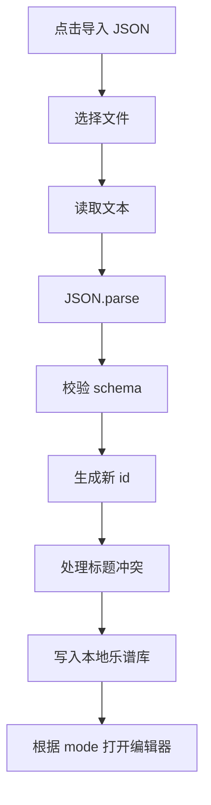

# 功能 PRD：JSON 导入导出

## 1. 功能目标

支持用户把洞洞谱导出为 JSON 文件，也支持从 JSON 文件导入乐谱到本地乐谱库，并自动打开对应编辑器。

导入导出用于：

- 本地备份
- 跨设备迁移
- 分享给他人继续编辑
- 后续指法表更新后重新生成数字谱模式结果

## 2. 导出范围

导出完整 `SavedScore`，不只导出 `holeScore.items`。

必须包含：

- `schemaVersion`
- `type`
- `id`
- `title`
- `mode`
- `createdAt`
- `updatedAt`
- `config`
- `source`
- `holeScore`
- `meta`

## 3. 导出入口

支持两个位置：

1. 编辑器内导出当前乐谱。
2. 洞洞谱首页列表中导出某一首乐谱。

编辑器内导出时，如果当前内容尚未保存：

- 可以先基于当前编辑状态临时组装 `SavedScore` 并导出。
- 导出不改变 `dirty` 状态。
- 不强制写入 localStorage。

## 4. 文件名

```text
{乐谱标题}.dizi-hole-score.json
```

标题为空时：

```text
未命名乐谱.dizi-hole-score.json
```

文件名需要过滤不适合文件系统的字符。

## 5. 导入流程



## 6. 导入校验

公共字段必须满足：

| 字段 | 要求 |
|---|---|
| `schemaVersion` | 当前支持 `1` |
| `type` | 必须为 `dizi-hole-score` |
| `mode` | `jianpu-generated` 或 `manual-hole-score` |
| `title` | 字符串，可以为空 |
| `config` | 必须存在 |
| `source` | 必须存在 |
| `holeScore` | 必须存在 |

数字谱模式额外要求：

- `source.kind = 'jianpu'`
- `source.text` 为字符串
- `config.scoreKey` 合法
- `config.fluteKey` 合法
- `config.fingeringProfileId` 合法

手动模式额外要求：

- `source.kind = 'manual-hole-score'`
- `holeScore.items` 为数组
- 每个 item 类型合法

## 7. 兼容策略

原始 PRD 中使用过：

```text
fingeringMode: "tube-as-5"
```

当前代码使用：

```text
fingeringProfileId: "tube_as_5"
```

第一版导入可以兼容 `fingeringMode`：

| 导入字段 | 内部字段 |
|---|---|
| `tube-as-5` | `tube_as_5` |
| `tube-as-2` | `tube_as_2` |
| `tube-as-1` | `tube_as_1` |

导出统一使用内部字段 `fingeringProfileId`。

## 8. 冲突处理

导入永远生成新 id，不覆盖已有乐谱。

标题重复时自动改名：

```text
小星星（导入）
小星星（导入 2）
```

## 9. 错误提示

| 场景 | 提示 |
|---|---|
| 文件不是 JSON | 这个文件不是有效的洞洞谱 JSON |
| `type` 不匹配 | 这个 JSON 不是竹笛洞洞谱文件 |
| 版本不支持 | 这个乐谱版本暂不支持 |
| 缺少数字谱内容 | 乐谱文件缺少数字谱内容，无法导入 |
| 缺少洞洞谱内容 | 乐谱文件缺少洞洞谱内容，无法导入 |
| 存储失败 | 导入成功解析，但保存到本地失败 |

## 10. 非目标

- 不导入 PDF、图片、MIDI。
- 不批量导入多个文件。
- 不覆盖同 id 乐谱。
- 不做云端同步。

## 11. 验收标准

1. 编辑器内可以导出当前乐谱 JSON。
2. 首页列表可以导出指定乐谱 JSON。
3. 导出的 JSON 包含完整 `SavedScore`。
4. 导出不会改变 `dirty` 状态。
5. 正确 JSON 可以导入并出现在本地列表。
6. 导入后自动打开对应编辑器。
7. 导入重复标题会自动改名。
8. 错误 JSON 或不支持版本有友好提示。
9. 导入不会覆盖已有乐谱。

